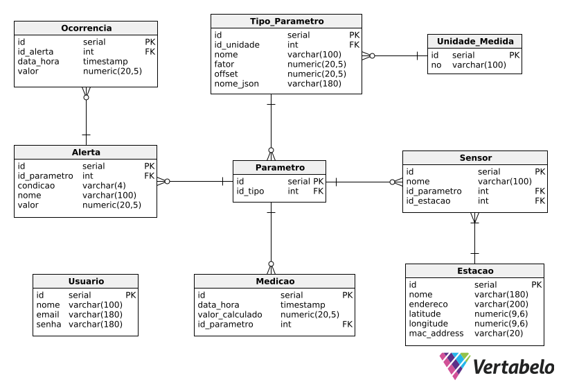

# API_4_BD
Referente ao Banco de Dados da API do quarto semestre da FATEC

# Modelo

# Diretórios

* `./modelo` - Pasta da imagem do modelo de dados
* `./sql` - Pasta do arquvio .sql com o código do banco

# Dicionário de Dados

    
Alerta

|   Colunas    | Tipo de dados | Comprimento |  Restrições  | Valor padrão |              Descrição               |
| :----------: | :-----------: | :---------: | :----------: | :----------: | :----------------------------------: |
|      id      |    SERIAL     |   Default   | PK, NOT NULL |   IDENTITY   |  Número de identificação do alerta   |
|  id_estacao  |      INT      |   Default   | FK, NOT NULL |   IDENTITY   |  Número de identificação da estação  |
| id_parametro |      INT      |   Default   | FK, NOT NULL |   IDENTITY   | Número de identificação do parâmetro |
|   condicao   |    VARCHAR    |      4      |   NOT NULL   |     N/A      |          Condição da alerta          |
|     nome     |    VARCHAR    |     100     |   NOT NULL   |     N/A      |            Nome do alerta            |
|    valor     |    NUMERIC    |   (20, 5)   |   NOT NULL   |     N/A      |           Valor do alerta            |

    
Estacao

|   Colunas   | Tipo de dados | Comprimento |  Restrições  | Valor padrão |             Descrição              |
| :---------: | :-----------: | :---------: | :----------: | :----------: | :--------------------------------: |
|     id      |    SERIAL     |   Default   | PK, NOT NULL |   IDENTITY   | Número de identificação da estação |
|    nome     |    VARCHAR    |     180     |   NOT NULL   |     N/A      |          Nome da estação           |
|  endereco   |    VARCHAR    |     200     |   NOT NULL   |     N/A      |        Endereco da estação         |
|  latitude   |    NUMERIC    |   (9, 6)    |   NOT NULL   |     N/A      |        Latitude da estação         |
|  longitude  |    NUMERIC    |   (9, 6)    |   NOT NULL   |     N/A      |        Longitude da estação        |
| mac_address |    VARCHAR    |     20      |   NOT NULL   |     N/A      |       Mac address da estação       |

    
Medicao

|     Colunas     | Tipo de dados | Comprimento |  Restrições  | Valor padrão |             Descrição              |
| :-------------: | :-----------: | :---------: | :----------: | :----------: | :--------------------------------: |
|       id        |    SERIAL     |   Default   | PK, NOT NULL |   IDENTITY   | Número de identificação da medição |
|    id_sensor    |      INT      |   Default   |      FK      |   IDENTITY   | Número de identificação do sensor  |
|    data_hora    |   TIMESTAMP   |   Default   |   NOT NULL   |     N/A      |       Data e hora da medição       |
| valor_calculado |    NUMERIC    |   (20, 5)   |   NOT NULL   |     N/A      |     Valor Calculado da medição     |

    
Ocorrencia

|  Colunas  | Tipo de dados | Comprimento |  Restrições  | Valor padrão |               Descrição               |
| :-------: | :-----------: | :---------: | :----------: | :----------: | :-----------------------------------: |
|    id     |    SERIAL     |   Default   | PK, NOT NULL |   IDENTITY   | Número de identificação da ocorrência |
| id_alerta |      INT      |   Default   |      FK      |   IDENTITY   |   Número de identificação do alerta   |
| data_hora |   TIMESTAMP   |   Default   |   NOT NULL   |     N/A      |       Data e hora da ocorrência       |
|   valor   |    NUMERIC    |   (20, 5)   |   NOT NULL   |     N/A      |          Valor da ocorrência          |

    
Parametro

|   Colunas    | Tipo de dados | Comprimento |  Restrições  | Valor padrão |                  Descrição                   |
| :----------: | :-----------: | :---------: | :----------: | :----------: | :------------------------------------------: |
|      id      |    SERIAL     |   Default   | PK, NOT NULL |   IDENTITY   |     Número de identificação do parâmetro     |
|  id_unidade  |      INT      |   Default   |      FK      |   IDENTITY   | Número de identificação da unidade de medida |
|     nome     |    VARCHAR    |     100     |   NOT NULL   |     N/A      |              Nome do parâmetro               |
|    fator     |    NUMERIC    |   (20, 5)   |   NOT NULL   |     N/A      |              Fator do parâmetro              |
| valor_offset |    NUMERIC    |   (20, 5)   |   NOT NULL   |     N/A      |             Offset do parâmetro              |
|  nome_json   |    VARCHAR    |     180     |   NOT NULL   |     N/A      |          Nome do json do parâmetro           |

    
Sensor

|   Colunas    | Tipo de dados | Comprimento |  Restrições  | Valor padrão |              Descrição               |
| :----------: | :-----------: | :---------: | :----------: | :----------: | :----------------------------------: |
|      id      |    SERIAL     |   Default   | PK, NOT NULL |   IDENTITY   |  Número de identificação do sensor   |
| id_parametro |      INT      |   Default   | FK, NOT NULL |   IDENTITY   | Número de identificação do parâmetro |
|     nome     |    VARCHAR    |     100     |   NOT NULL   |     N/A      |          Nome do sensor           |

    
SensorEstacao

|  Colunas   | Tipo de dados | Comprimento |  Restrições  | Valor padrão |                         Descrição                          |
| :--------: | :-----------: | :---------: | :----------: | :----------: | :--------------------------------------------------------: |
|     id     |    SERIAL     |   Default   | PK, NOT NULL |   IDENTITY   | Número de identificação da relação do sensor com a estação |
| id_sensor  |      INT      |   Default   | FK, NOT NULL |   IDENTITY   |             Número de identificação do sensor              |
| id_estacao |      INT      |   Default   | FK, NOT NULL |   IDENTITY   |             Número de identificação da estação             |

    
Unidade_Medida

| Colunas | Tipo de dados | Comprimento |  Restrições  | Valor padrão |                  Descrição                   |
| :-----: | :-----------: | :---------: | :----------: | :----------: | :------------------------------------------: |
|   id    |    SERIAL     |   Default   | PK, NOT NULL |   IDENTITY   | Número de identificação da unidade de medida |
|  nome   |    VARCHAR    |     100     |   NOT NULL   |     N/A      |          Nome da unidade de medida           |

    
Usuario

| Colunas | Tipo de dados | Comprimento |  Restrições  | Valor padrão |             Descrição              |
| :-----: | :-----------: | :---------: | :----------: | :----------: | :--------------------------------: |
|   id    |    SERIAL     |   Default   | PK, NOT NULL |   IDENTITY   | Número de identificação do usuário |
|  nome   |    VARCHAR    |     100     |   NOT NULL   |     N/A      |          Nome do usuário           |
|  email  |    VARCHAR    |     180     |   NOT NULL   |     N/A      |          Email do usuário          |
|  senha  |    VARCHAR    |     180     |   NOT NULL   |     N/A      |          Senha do usuário          |

## Descrição das branches
Cada branch é referente a uma tarefa ou um conjunto de tarefas.

- X: Exemplo - Responsável

## Padrão de branch
"Task-{numero da tarefa referente a branch}"

"Task-1"    
"Task-2"

## Padrão de Commit
"{numero da tarefa referente a branch} - {descrição do que fez}"    
"{tipo de commit}: {descrição do que fez}"

"1.1 - Adição da rota de cadastro de ativo"     
"fix: Correção na exibição do elemento X"

### Tipos de Commit

* fix - Indica que o trecho de código commitado está solucionando um problema ou bug.
* docs - Indica que houveram mudanças na documentação.
* test - Indica que houveram alterações criando, alterando ou excluindo testes;
* build - Indica que houveram alterações relacionadas a build do projeto/dependências.
* refactor - Indica que uma parte do código foi refatorada sem alterar nenhuma funcionalidade.
* ci - Indica mudanças relacionadas a integração contínua (Continuous Integration).
* cleanup - Indica a remoção de código comentado ou trechos desnecessários no código-fonte.
* remove - Indica a exclusão de arquivos, diretórios ou funcionalidades obsoletas ou não utilizadas.
