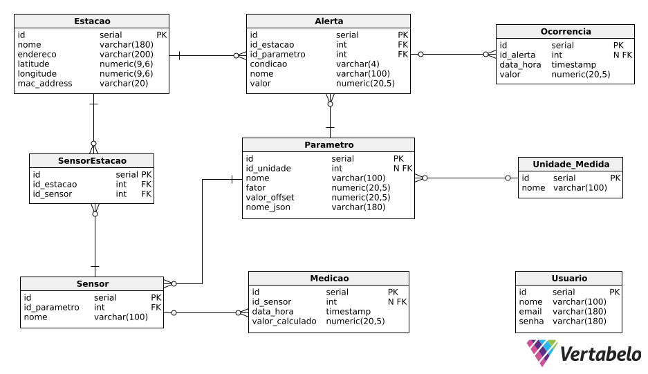

# API_4_BD
Referente ao Banco de Dados da API do quarto semestre da FATEC

# Modelo

<!--  -->

# Diretórios

<!-- * `./modelo` - Arquivos do modelo de dados
* `./sql` - Arquivos .SQL com o código do banco
    * `/functions` - Arquivos .SQL com as funções do banco
    * `/procedures` - Arquivos .SQL com as procedures do banco
    * `/tables` - Arquivos .SQL para a criação das tabelas
    * `/triggers` - Arquivos .SQL com os triggers do banco -->

# Dicionário de Dados

Ativo

<!-- | Colunas | Tipo de dados | Comprimento | Restrições | Valor padrão | Descrição |
|:-:|:-:|:-:|:-:|:-:|:-:|
| id | INT | Default | PK, NOT NULL | IDENTITY | Número de identificação do ativo | -->

AtivoTangivel

<!-- | Colunas | Tipo de dados | Comprimento | Restrições | Valor padrão | Descrição |
|:-:|:-:|:-:|:-:|:-:|:-:|
| id_ativo | INT | Default | PK, FK, NOT NULL | N/A | Número de identificação do ativo | -->

AtivoIntangivel

<!-- | Colunas | Tipo de dados | Comprimento | Restrições | Valor padrão | Descrição |
|:-:|:-:|:-:|:-:|:-:|:-:|
| id_ativo | INT | Default | PK, FK, NOT NULL | N/A | Número de identificação do ativo | -->

Usuario

<!-- | Colunas | Tipo de dados | Comprimento | Restrições | Valor padrão | Descrição |
|:-:|:-:|:-:|:-:|:-:|:-:|
| id | INT | Default | PK, NOT NULL | SERIAL | Número de identificação do usuário | -->

UsuarioLogin

<!-- | Colunas | Tipo de dados | Comprimento | Restrições | Valor padrão | Descrição |
|:-:|:-:|:-:|:-:|:-:|:-:|
| id | INT | Default | PK, FK, NOT NULL | SERIAL | Número de identificação do usuário | -->

## Descrição das branches
Cada branch é referente a uma tarefa ou um conjunto de tarefas.

- X: Exemplo - Responsável

## Padrão de branch
"Task-{numero da tarefa referente a branch}"

"Task-1"    
"Task-2"

## Padrão de Commit
"{numero da tarefa referente a branch} - {descrição do que fez}"    
"{tipo de commit}: {descrição do que fez}"

"1.1 - Adição da rota de cadastro de ativo"     
"fix: Correção na exibição do elemento X"

### Tipos de Commit

* fix - Indica que o trecho de código commitado está solucionando um problema ou bug.
* docs - Indica que houveram mudanças na documentação.
* test - Indica que houveram alterações criando, alterando ou excluindo testes;
* build - Indica que houveram alterações relacionadas a build do projeto/dependências.
* refactor - Indica que uma parte do código foi refatorada sem alterar nenhuma funcionalidade.
* ci - Indica mudanças relacionadas a integração contínua (Continuous Integration).
* cleanup - Indica a remoção de código comentado ou trechos desnecessários no código-fonte.
* remove - Indica a exclusão de arquivos, diretórios ou funcionalidades obsoletas ou não utilizadas.
